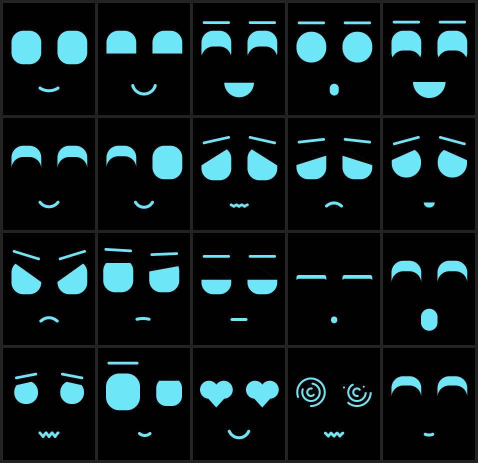
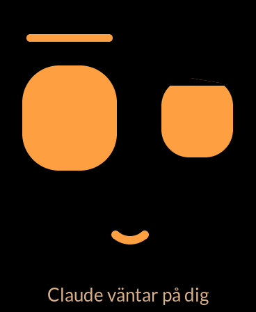
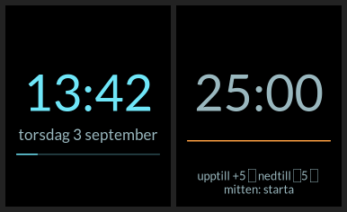

# Office Buddy

A small face on your shelf that blinks, yawns, looks at you and follows a
mood over the day. It tells you when Claude or Codex is waiting for you, when a
meeting starts in ten minutes, when a reminder is due, and when a new mail
arrives, and it says very little else. No words spoken, only eyes, a mouth,
colours and a few soft chimes.

It runs on a Waveshare **ESP32-S3-Touch-AMOLED-1.8** (368 × 448, portrait)
that sits in your Mac's USB-C port. The face, the mood and the wire protocol
are shared between the board and an SDL emulator, so you can watch it on
your laptop before you flash anything.



*Swedish version: [README.sv.md](README.sv.md). The code and its comments
are in Swedish; the protocol keywords are too. That is part of its charm.*

## What makes it a buddy and not a gadget

1. **Irregularity.** A blink every three seconds is an animation; one after
   2.4 s, then 5.1 s, then a double blink, is a creature. Nothing repeats
   exactly.
2. **Inner state, not reactions.** Energy follows the clock (bright in the
   morning, slow around three, asleep at night), joy rises when something
   nice happens and fades, worry comes from what is left undone. The face
   follows the state, never a single event.
3. **Silence is a feature.** It speaks rarely and prefers the face to text.
4. **Only real things.** Every line it shows comes from your calendar, your
   mail, your reminders or your own tools.
5. **It looks at you.** The gaze wanders, stops, comes back.

## What it does

| Signal | Behaviour |
|---|---|
| Claude Code needs you | turns **orange**, looks up, "Claude väntar: project", rising two-tone; each session announced separately |
| Meeting in 10 min | orange, "möte om 10 min: title", two-tone; jingle when it starts |
| Reminder due | orange for 30 s, "påminnelse: title", a blip |
| New mail | large **@ @** eyes, envelope, account colour and a dedicated short mail melody |
| SMS or Teams message | a speech bubble bounces in, the app's colour, a blip (`server/Notiser.app` reads Notification Center; grant it Full Disk Access) |
| Screen locked / unlocked | sleeps when you lock the Mac, wakes and looks at you when you unlock |
| Nightly backup missing | orange, worried, "backup saknas" (optional, reads your own status files) |
| Timer done | orange, "tiden är ute", jingle |
| A movement bump | a brief surprised glance; never acknowledges an agent |
| Swipe left | a clock: big digits, the date, seconds as a growing line |
| Swipe again | a timer: tap top +5 min, bottom −5, middle to start |
| Lift the board | surprised; wakes it up if asleep |
| Computer asleep | the buddy sleeps too; wakes with a jingle when you are back |
| Side buttons | volume down (BOOT) and up (power key), remembered across reboots |
| Boot | "Power up" in text, two blocks that grow into eyes, a jingle |
| Asleep | eyes become soft waves; a few times a night it dreams in colourful TV static |
| Nothing for 20 min | sometimes a fly buzzes across the glass and the gaze follows it out |

Orange marks a pending question or timed reminder. Agent questions stay visible
until the computer clears them, their source expires, or you send `tysta`.
A tap never acknowledges or answers an agent.



## Event scenes and VibePulse

Mail opens the eyes into **@ @**, then relaxes into a smile. Claude and Codex
get their respective logo in both eyes and distinct chimes. Completion now holds the logo until new work starts in the same agent, the source disappears, or you explicitly silence it. Meetings get a
clock, and completed agent turns get a short jump with stars. Timed scenes
return automatically; the buddy is designed to be useful beyond arm's reach.

The new `delat/signaler.c` scheduler gives meetings priority over agent
questions, then mail/completion scenes. Deferred scenes expire after one
minute; repeated mail chimes are limited to once a minute. SMS/Teams, reminders and backup warnings wait in the same queue behind
meetings and agent questions.

The Mac link reads VibePulse's local `/api/agent-status` v2 endpoint every
two seconds in a background thread. Configure `agentstatus_url` and
`agentstatus_aktorer` in `server/buddy.json`. The default endpoint is
`http://127.0.0.1:8737/api/agent-status`, with only `codex` enabled because
Claude already has direct hooks. An empty URL disables the bridge. To use
VibePulse for Claude too, remove the direct hooks and add `claude` to the list.
VibePulse's tokenserver must already be running; Office Buddy does not install it.

Only explicit `waiting_input`, `waiting_approval`, or a live `pending` request
causes a question. Generic `waiting` does not. Codex questions require a source
that actually publishes these signals (for example VibePulse's configured
interaction bridge); ordinary session logs alone may not include them.
This reader never sends decisions to VibePulse or either agent.

Each pending request is refreshed; a missing request clears without claiming
it was answered. After 30 seconds without the server, questions are cleared;
the board also expires unrefreshed VibePulse questions after 90 seconds.
Direct Claude hook questions expire after two hours as a fallback. Old completed
turns do not replay at startup. The USB heartbeat runs independently of the
optional pulse service.

Examples through the running link service (no competing serial reader):

```bash
python3 server/buddylank.py --skicka "mejl Test sender"
python3 server/buddylank.py --skicka "agent codex vantar demo Office-buddy"
python3 server/buddylank.py --skicka "agent codex jobbar demo Office-buddy"
python3 server/buddylank.py --skicka "agent codex klar demo Office-buddy"
python3 server/buddylank.py --skicka "mote 10 Project meeting"
python3 server/buddylank.py --skicka "tysta"
```

`tysta` dismisses the display; it never approves a command or answers a question.
The same commands work with the simulator's `--rad` option. Run
`python3 -m unittest discover -s test` and `sim/build/office-buddy-sim --kontroll`
for bridge and real-LVGL event lifecycle checks. For an external LVGL checkout,
configure the simulator with `-DLVGL_DIR=/absolute/path/to/lvgl`.

After updating the firmware, restart the link service and rerun
`python3 server/claude-krokar.py` to add the AskUserQuestion lifecycle hooks.
Physical timing, volume and motion sensitivity still need review on the board.

## Hardware

Waveshare ESP32-S3-Touch-AMOLED-1.8. Everything on the board gets a job:

| Part | Role |
|---|---|
| CO5300 AMOLED, CST816S touch | the face, taps and swipes |
| QMI8658 IMU | knocks and lifts |
| PCF85063 RTC | time of day for the mood |
| ES8311 codec | a few soft chimes and a little jingle |
| TCA9554 expander | panel power and reset (see the lesson below) |

No battery. The board lives on USB-C for power. The data link is USB when the
board sits in your Mac, and **Wi-Fi** otherwise: the board announces itself as
`office-buddy.local` and the link on your Mac finds it there as long as both
are on the same network. Unplug the laptop and walk off, and the buddy keeps
going on whatever powers its cable; when the Mac has been silent for two
minutes it goes to sleep, and wakes with a jingle when you are back.

## Quick start

You need ESP-IDF 5.5, CMake, Ninja and SDL2 (`brew install sdl2 cmake ninja`)
on macOS, plus Xcode command line tools for the calendar helper.

**1. Watch it in the emulator**

```bash
cmake -S sim -B sim/build -G Ninja && ninja -C sim/build && ./sim/build/office-buddy-sim
```

Left/right cycle expressions, `M` hands control back to the mood, `B`
blinks, `G` yawns, `P` pokes, `K`/`L`/`A` knock/lift/tick-off, `V` swipes
between views, `+`/`-` turn the clock. The emulator reads the same protocol
lines on stdin as the board does on USB.

**2. Flash the board**

Optional but recommended: put your Wi-Fi password in the macOS keychain and
generate `firmware/main/secrets.h` (gitignored). Without it the firmware
builds without Wi-Fi and the buddy works on USB only.

```bash
security add-generic-password -a "$USER" -s office-buddy-wifi -w
OFFICE_BUDDY_SSID="your 2.4 GHz network" verktyg/generera-secrets.sh
```

```bash
source ~/esp/esp-idf/export.sh && cd firmware && idf.py set-target esp32s3 && idf.py build
idf.py -p /dev/cu.usbmodem* flash
```

**3. Start the link on your Mac**

```bash
cp server/buddy.example.json server/buddy.json   # then edit
server/installera.sh
```

The link finds the board, sets its clock and time zone, and feeds it
calendar, mail and reminders from the macOS apps. The first run asks for
calendar and reminder access. Mail must be running. Logs go to
`~/Library/Logs/office-buddy.log`. Stop the service before flashing:
`launchctl unload ~/Library/LaunchAgents/se.critero.office-buddy.plist`.

**4. Let Claude Code talk to it**

```bash
python3 server/claude-krokar.py
```

This installs lifecycle hooks to `~/.claude/settings.json` (a backup is written)
that post to the link's mailbox when Claude waits, finishes or resumes.

## The mailbox

Anything on your Mac can talk to the buddy by posting protocol lines to
`http://127.0.0.1:8739/`, one per line:

```bash
curl -s -X POST --data-binary "sag lunch in ten minutes" http://127.0.0.1:8739/
curl -s -X POST --data-binary "timer 25" http://127.0.0.1:8739/
curl -s -X POST --data-binary "spela trudelutt" http://127.0.0.1:8739/
```

The full protocol is documented in [`delat/protokoll.h`](delat/protokoll.h):
`hej`, `status`, `tid`, `vantande`, `aldst`, `avbockat`, `peta`, `knack`,
`lyft`, `uttryck`, `sag`, `ljus`, `ljud`, `spela`, `claude`, `mote`, `mejl`,
`paminnelse`, `backup`, `vy`, `timer`, `agent`, `tysta`.

## How it is built

- `delat/` is shared between board and emulator: `ansikte.c` (the face:
  shapes, expressions, blinking, gaze, breathing, colour), `humor.c` (the
  mood and everything it decides to say), `vyer.c` (clock and timer),
  `protokoll.c` (the wire protocol).
- `firmware/` is the thin ESP-IDF layer: panel, touch, IMU, codec, buttons,
  USB link, RTC.
- `sim/` is the SDL emulator, with headless modes that render stills and
  sequences for review.
- `server/` is the Mac side: the link, the calendar/reminder helper
  (EventKit, Swift), the installers and the Claude hooks.

The face is drawn from shapes, not images: eyes are rounded rectangles with
a dark pupil that follows the gaze and makes small saccades of its own, cut
by black lids and arcs, brows are strokes, the mouth is an arc, a line or an
open shape. Every expression is a set of numbers, and motion is those
numbers gliding towards their targets, so nothing ever jumps.



## Lessons that cost time

- **Black screen on a board that is still alive.** The panel's power enable
  and reset go through the TCA9554 expander (EXIO1 and EXIO0), and the
  Waveshare BSP never drives it, so the panel hung on a pull-up and went
  dark after five to eight minutes. `firmware/main/panelstrom.c` drives the
  pins and gives the panel a proper reset. If you use this board with the
  BSP, you want this.
- **Never send a panel command while LVGL flushes.** The brightness command
  shares the SPI bus with pixel data and esp_lcd's panel IO is not thread
  safe. Everything that touches the panel runs under the LVGL lock.
- **LVGL fonts must be generated with `--no-compress`**, and must contain
  every character you print, or text silently vanishes.
- **A large struct must not live on a task stack.** ESP32 reboots without a
  Guru Meditation when it does.

## Related

[VibePulse](https://github.com/niclasvestlund-YT/vibepulse) by Niclas
Vestlund shows Claude Code and Codex usage live on the 2.16-inch sibling of
this board. Office Buddy runs on the 1.8-inch one. They get along.

## Licence

MIT. Fonts: Lato, SIL Open Font License.

### Notification delivery checks

The macOS notification helper reads SQLite in read-only WAL-aware mode, polls every two seconds, coalesces bursts per app type and retries failed HTTP delivery for up to two minutes. It logs receipt and delivery without message content. Use `Notiser.app/Contents/MacOS/notiser --diagnostik` to inspect app identifiers; the launchd service must have Full Disk Access. Mail, calendar and reminder checks run outside the USB loop so a slow source cannot hold up other signals. A protocol acknowledgement confirms receipt, not physical visibility or sound.
